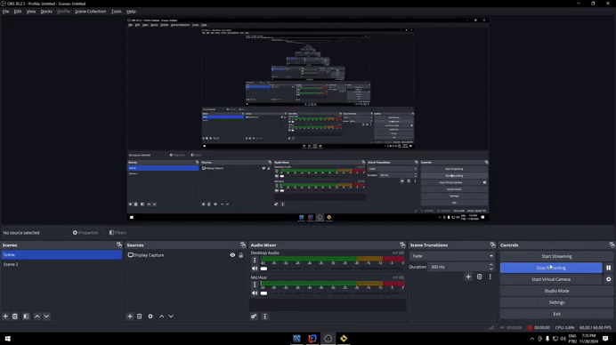
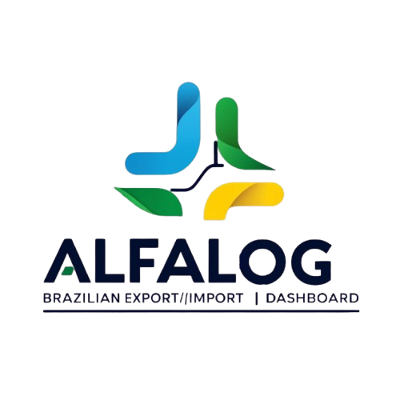
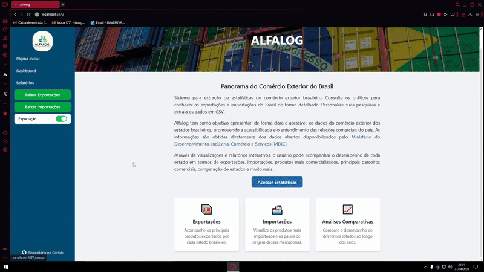
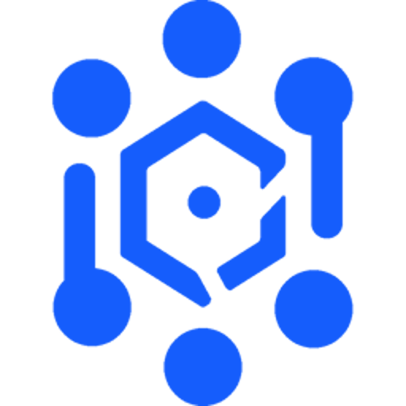
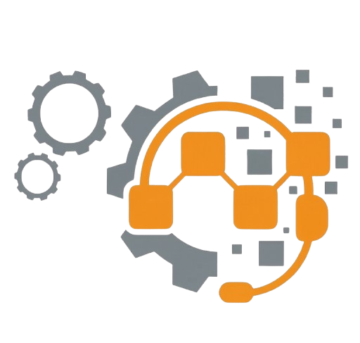

# Humberto Ishii Silva

## Sobre Mim
Sou estudante de Análise e Desenvolvimento de Sistemas na FATEC São José dos Campos - Prof. Jessen Vidal. Possuo formação técnica em Mecatrônica e vivência acadêmica anterior em Engenharia Mecatrônica, onde o primeiro contato com lógica e programação despertou meu interesse pelo desenvolvimento de software e guiou minha transição para a área de tecnologia.

Meu foco principal é no desenvolvimento **Back-end**, especialmente na construção de APIs, implementação de regras de negócio, modelagem de bancos de dados e integração entre sistemas. Também tenho forte interesse e experiência prática com agentes de **Inteligência Artificial**, além de desenvolver soluções **Full Stack** para web e mobile.

Busco oportunidades para atuar no mercado como desenvolvedor. Nos projetos integradores da graduação, vivencio na prática a rotina de times ágeis utilizando Scrum em sprints, participando das decisões de arquitetura e entregando software funcional.

  

## Contatos
- **GitHub:** [github.com/HumbertoIshii](https://github.com/HumbertoIshii/)
- **LinkedIn:** [linkedin.com/in/humberto-ishii-silva](https://www.linkedin.com/in/humberto-ishii-silva/)
- **Email:** [humbertosjc98@gmail.com](mailto:humbertosjc98@gmail.com)

## Principais Conhecimentos

### Linguagens de Programação
- Python
- JavaScript
- TypeScript
- Java

### Frontend
- HTML5 / CSS3
- React
- Tailwind CSS
- Bootstrap

### Backend
- Node.js
- NestJS
- FastAPI
- Flask

### Mobile
- React Native
- Expo

### Bancos de Dados
- MySQL
- PostgreSQL
- MongoDB
- ChromaDB

### Outras Ferramentas e Práticas
- Git e GitHub
- AWS
- Ollama (Modelos Locais)
- Metodologias Ágeis (Scrum)

---

# Meus Projetos

##  Scrum Teach - 2024 - 1º Semestre

### Empresa Parceira
Projeto desenvolvido em parceria com a **FATEC São José dos Campos - Prof. Jessen Vidal**, com o professor Antonio Egydio atuando no papel de cliente. Ele foi responsável por definir os requisitos e validar as entregas da equipe a cada sprint, simulando a rotina de desenvolvimento ágil com Scrum em um cenário prático.

### Problema
Profissionais e equipes que estão começando a adotar métodos ágeis frequentemente têm dificuldade para assimilar os conceitos e práticas do Scrum sem um suporte estruturado. O cliente precisava de uma plataforma de treinamento que centralizasse conteúdos didáticos e testes de conhecimento, permitindo que os colaboradores aprendessem os conceitos fundamentais e acompanhassem sua evolução por meio de questionários.

### Solução
A equipe desenvolveu a **Scrum Teach**, uma aplicação web voltada para o ensino prático da metodologia ágil. A plataforma organiza os conceitos do Scrum em módulos didáticos e visuais, explicando detalhadamente os papéis (Product Owner, Scrum Master e Time de Desenvolvimento), as cerimônias (Planning, Daily, Review e Retrospectiva) e os artefatos do framework.

O sistema também conta com quizzes interativos para fixação do conteúdo e acompanhamento do progresso dos usuários. A interface foi projetada para ser simples e responsiva, garantindo uma boa navegação em computadores e celulares.

### Repositório no GitHub
- [Scrum Teach (API 1º Semestre)](https://github.com/HumbertoIshii/API1Semestre)

### Tecnologias Utilizadas
- **Python (Flask):** Desenvolvimento da lógica de back-end, autenticação de usuários e controle de sessões.
- **MySQL:** Armazenamento de cadastros, comentários e histórico de pontuações.
- **HTML5 e CSS3:** Estruturação das páginas e estilização da interface.
- **Bootstrap:** Criação de componentes padronizados e adaptação de layout responsivo.
- **AWS:** Hospedagem da aplicação na nuvem.
- **Git e GitHub:** Controle de versão do código e fluxo de trabalho em equipe.
- **Figma:** Prototipagem das telas e planejamento da navegação.

### Contribuições Pessoais
No projeto, atuei como Scrum Master e desenvolvedor full-stack.

Na parte de desenvolvimento, fui responsável por criar o sistema de autenticação (cadastro, login e controle de sessão) usando **Python (Flask)** integrado ao banco de dados **MySQL**. No front-end, trabalhei na criação e estilização das páginas de conteúdo com **HTML5**, **CSS3** e **Bootstrap**, tornando o layout responsivo para garantir uma boa visualização tanto no computador quanto no celular.

Como Scrum Master, fiquei encarregado de acompanhar o andamento das tarefas, conduzir as reuniões da equipe (plannings, dailies e retrospectivas), organizar o backlog no repositório e ajudar a destravar qualquer impedimento técnico ou de alinhamento para garantir as entregas das sprints.

### Hard Skills
- **Python (Flask):** Sei fazer com autonomia: criação de rotas, regras de negócio e controle de autenticação/sessão.
- **MySQL:** Sei fazer com autonomia: modelagem de tabelas relacionais e integração de consultas à aplicação.
- **HTML5 e CSS3:** Sei fazer com autonomia: estruturação de páginas e personalização visual da interface.
- **Bootstrap:** Sei fazer com autonomia: construção de layouts responsivos e uso de componentes prontos.
- **Git e GitHub:** Sei fazer com autonomia: versionamento de código, fluxo de branches e resolução de conflitos.
- **Figma:** Sei fazer com autonomia: prototipagem de telas e planejamento visual da navegação.
- **Metodologia Scrum:** Sei fazer com autonomia: organização do backlog, condução de cerimônias ágeis e acompanhamento das sprints.

### Soft Skills
- **Comunicação e Facilitação:** Conduzi as reuniões ágeis como Scrum Master, mantendo o alinhamento de expectativas com o time e identificando impedimentos antes que se tornassem bloqueios.
- **Organização e Gestão de Tempo:** Equilibrei a gestão das tarefas da equipe com as minhas entregas técnicas de código (sistema de login e telas), cumprindo os prazos das sprints.
- **Resolução de Problemas:** Investiguei e corrigi falhas no controle de sessão e login com Flask/MySQL, além de auxiliar na resolução de conflitos de merge no Git.

### Demonstração do Projeto

#### Sistema de Login e Comentários
https://github.com/user-attachments/assets/df168210-c5b7-4ed4-b8e2-2f9670607d12

#### Sistema de Avaliação e Quizzes
https://github.com/user-attachments/assets/83918c80-08e1-4ffc-bc2a-3b04e3743ff6

---

##  Alplaca - 2024 - 2º Semestre

### Empresa Parceira
Projeto desenvolvido em parceria com a **FATEC São José dos Campos - Prof. Jessen Vidal**, tendo o professor Giuliano Bertoti como cliente. Ele direcionou os requisitos e validou as entregas a cada sprint no desenvolvimento de uma aplicação desktop com inteligência artificial executada localmente.

### Problema
O controle de veículos em estacionamentos e frotas frequentemente depende de anotações manuais, sujeitas a lentidão e erros, ou de serviços de visão computacional em nuvem. No entanto, o uso de APIs externas de IA traz custos recorrentes, exige conexão contínua com a internet e levanta preocupações com a privacidade e segurança das imagens trafegadas. Havia a necessidade de uma solução capaz de reconhecer placas veiculares diretamente na máquina do usuário, de forma rápida, segura e sem dependência de serviços externos pagos.

### Solução
Desenvolvemos o **Alplaca**, uma aplicação desktop em Java integrada ao MySQL e a modelos de visão computacional executados localmente via Ollama. O sistema realiza a leitura óptica de caracteres (OCR) das placas de veículos a partir de imagens, funcionando totalmente offline.

Além da extração e leitura das placas pela IA, o software conta com gerenciamento completo de registros (CRUD), permitindo cadastrar, consultar, atualizar e remover veículos, além de oferecer busca com filtros por placa, histórico de movimentações e visualização das fotos associadas.

### Repositório no GitHub
- [Alplaca (Bug Busters)](https://github.com/Bug-Busters-F/alplaca)

### Tecnologias Utilizadas
- **Java:** Desenvolvimento da lógica da aplicação, regras de negócio e integração dos módulos.
- **Java Swing:** Construção da interface gráfica desktop para interação com o usuário.
- **Ollama e ollama4j:** Execução local e integração de modelos multimodais de IA para leitura de caracteres em imagens.
- **MySQL:** Banco de dados relacional para persistência de veículos, placas e histórico.
- **Git e GitHub:** Controle de versão do código e fluxo colaborativo da equipe.
- **Figma:** Prototipagem e planejamento visual das telas.

### Contribuições Pessoais
No projeto, atuei como desenvolvedor, focando na integração dos modelos de Inteligência Artificial à aplicação e na implementação de funcionalidades do sistema.

Minha principal atuação técnica foi conectar o **Ollama** à aplicação em **Java** utilizando a biblioteca **ollama4j**. Realizei testes práticos para avaliar e selecionar o modelo que apresentasse o melhor equilíbrio entre tempo de resposta e precisão na leitura das placas. Além disso, elaborei e refinei a engenharia de prompts enviada junto às imagens para garantir a extração dos caracteres no padrão exigido pelo banco de dados.

Também atuei na interface gráfica com **Java Swing**, desenvolvendo a funcionalidade de busca com filtros para consulta de veículos cadastrados e auxiliando no ajuste de usabilidade e visual dos componentes da tela.

### Hard Skills
- **Ollama e ollama4j:** Sei fazer com autonomia: integração de modelos de IA locais ao Java, testes comparativos de modelos e engenharia de prompts.
- **MySQL:** Sei fazer com autonomia: modelagem de tabelas e persistência de dados e registros.
- **Git e GitHub:** Sei fazer com autonomia: versionamento de código, gerenciamento de branches e resolução de conflitos.
- **Metodologia Scrum:** Sei fazer com autonomia: participação ativa nas cerimônias ágeis, estimativas e entregas em sprints.
- **Java:** Sei fazer com ajuda: desenvolvimento da lógica de negócio e integração de bibliotecas com apoio de documentação.
- **Java Swing:** Sei fazer com ajuda: construção de telas, componentes gráficos e formulários de pesquisa.

### Soft Skills
- **Pensamento Crítico e Análise:** Conduzi testes comparativos entre modelos de visão computacional, avaliando taxa de acerto na leitura, tempo de resposta e consumo de hardware local.
- **Resolução de Problemas:** Tratei oscilações no retorno das respostas da IA, iterando nos prompts e criando validações no código até obter saídas consistentes para salvar no banco.
- **Comunicação e Alinhamento:** Mantive contato frequente com o time para definir a estrutura dos dados extraídos pela IA, garantindo a integração correta com o banco e a interface.
- **Trabalho em Equipe:** Atuei em conjunto com a equipe para conectar a camada de IA, a persistência no MySQL e a interface em Java Swing, mantendo o código sincronizado no repositório.

### Demonstração do Projeto

#### Classificação por Modelo de IA Local

  

#### Interface, Filtros de Busca e Edição

  

---

##  Alfalog - 2025 - 1º Semestre

### Empresa Parceira
Projeto desenvolvido em parceria com a **FATEC São José dos Campos - Prof. Jessen Vidal**, com o professor Marcus Nascimento (coordenador do curso de Logística) atuando no papel de cliente. Ele apresentou as demandas analíticas do setor de comércio exterior e acompanhou a validação dos incrementos a cada sprint.

### Problema
Bases governamentais de comércio exterior brasileiro (como MDIC e Comex Stat) reúnem milhões de registros de importação e exportação em arquivos brutos, pesados e fragmentados. Esse formato dificulta análises ágeis, tornando a identificação de padrões comerciais, gargalos em rotas alfandegárias e a comparação de desempenho econômico entre estados e municípios um processo lento e manual para profissionais da área.

### Solução
Desenvolvemos a **Alfalog**, uma aplicação web focada em inteligência e visualização de dados de comércio exterior. A plataforma centraliza e estrutura esses grandes volumes de registros históricos em um banco de dados relacional, transformando tabelas densas em painéis analíticos com gráficos e tabelas interativas.

O sistema conta com filtros dinâmicos por código NCM, estados, municípios, vias de transporte e períodos históricos (2014 a 2024), permitindo cruzar dados com rapidez e exportar relatórios customizados para apoiar o planejamento logístico e tomadas de decisão.

### Repositório no GitHub
- [Alfalog (Bug Busters)](https://github.com/Bug-Busters-F/Alfalog)

### Tecnologias Utilizadas
- **React e TypeScript:** Desenvolvimento da interface web, componentização dinâmica e consumo de dados da API.
- **Tailwind CSS:** Estilização da interface com foco em responsividade e padronização visual.
- **ApexCharts:** Construção dos gráficos interativos para séries temporais e volumes comerciais.
- **Python (Flask):** Criação da API REST, gerenciamento de rotas e rotinas de processamento de dados (ETL).
- **MySQL:** Armazenamento, estruturação e consulta otimizada de grandes volumes históricos.
- **AWS:** Hospedagem da aplicação na nuvem.
- **Git e GitHub:** Versionamento de código e fluxo de trabalho colaborativo.

### Contribuições Pessoais
No projeto, atuei como desenvolvedor full-stack, trabalhando tanto na construção das regras de negócio e rotas no back-end quanto na implementação de componentes e consumo de dados no front-end.

No back-end, utilizando **Python (Flask)** e **MySQL**, fui o responsável por modelar a tabela de balança comercial vinculada às Unidades Federativas (UFs). Para automatizar o processamento dos dados históricos públicos do Comex Stat, desenvolvi rotinas via linha de comando (`flask comex update balanca`) que liam os arquivos brutos, calculavam o saldo comercial anual de cada estado (valor FOB de exportação menos FOB de importação) e salvavam os dados estruturados no banco. Além disso, criei as rotas da API em Flask usando blueprints para fornecer os dados dos gráficos (como contagem de uso das alfândegas/URFs e séries temporais anuais) e os endpoints para os cards de desempenho dos estados.

No front-end, trabalhei com **React**, **TypeScript** e **Tailwind CSS**, desenvolvendo os componentes visuais dos cards de estados em alta e em queda integrados diretamente à API. Também atuei na refatoração da página de relatórios de dados, ajustando a exibição dos gráficos de barras e a descrição dos filtros. Para resolver problemas de compartilhamento de filtros entre componentes na exportação de relatórios, implementei a Context API do React com o `ExportContextProvider`, garantindo que os dados selecionados pelo usuário fossem repassados corretamente na geração dos arquivos.

### Hard Skills
- **Python (Flask):** Sei fazer com autonomia: criação de rotas e blueprints para APIs REST, desenvolvimento de comandos CLI para rotinas de ETL e cálculos comerciais.
- **MySQL:** Sei fazer com autonomia: modelagem de tabelas relacionais, indexação e otimização de consultas para grandes bases históricas.
- **React e TypeScript:** Sei fazer com autonomia: componentização reutilizável, tipagem de dados, consumo de APIs REST e gerenciamento de estado com Context API.
- **Tailwind CSS:** Sei fazer com autonomia: estilização utilitária de interfaces responsivas para dashboards analíticos.
- **Git e GitHub:** Sei fazer com autonomia: controle de versão, fluxo de branches, abertura de Pull Requests e resolução de conflitos.
- **Metodologia Scrum:** Sei fazer com autonomia: participação ativa no planejamento de sprints, divisão técnica de tarefas e cumprimento de prazos.

### Soft Skills
- **Comunicação Técnica:** Mantive alinhamento constante com o time para definir os contratos de requisição e resposta em JSON da API, assegurando que os dados chegassem no formato correto para os componentes gráficos do front-end.
- **Visão Sistêmica:** Conectei o fluxo completo da aplicação, desde a importação e cálculo dos dados brutos no Flask/MySQL até a renderização visual e exportação no React.
- **Resolução de Problemas:** Identifiquei falhas no compartilhamento de filtros entre componentes isolados na exportação de relatórios e criei uma solução centralizada usando Context API.
- **Trabalho em Equipe:** Participei ativamente das revisões de código em Pull Requests e apoiei colegas na resolução de conflitos de merge durante as sprints.

### Demonstração do Projeto

#### Dashboards, Gráficos e Tabelas Analíticas

  

---

##  ClassiPy - 2025 - 2º Semestre

### Empresa Parceira
Projeto desenvolvido em parceria com a **TecSys**, empresa especializada em soluções customizadas para telecomunicações, transmissão, sistemas embarcados e redes inteligentes. A empresa atuou como cliente externo, apresentando demandas reais dos seus processos de compras internacionais e validando as entregas a cada sprint.

### Problema
Para produzir equipamentos customizados, a TecSys importa componentes eletrônicos que não possuem fabricação nacional. A conferência dessas ordens de compra era realizada manualmente a partir de faturas e pedidos em PDF, onde a equipe precisava extrair códigos de peças (Part Numbers) e pesquisar dados fiscais como NCM, fabricante, país de origem e alíquotas. Por ser um processo manual e repetitivo, pequenos erros de digitação ou classificação podiam ocasionar atrasos aduaneiros, retenção de mercadorias pela Receita Federal e multas fiscais.

### Solução
Desenvolvemos o **ClassiPy**, uma plataforma web que utiliza inteligência artificial e automação web para acelerar e padronizar a classificação fiscal de componentes importados. O sistema recebe pedidos em PDF, faz a leitura dos itens, busca especificações técnicas na web e sugere o código NCM, fabricante, alíquota e descrição correspondente.

A plataforma conta com uma interface para que o usuário revise, edite e valide as sugestões da IA antes de salvar. Além disso, utiliza busca vetorial com embeddings para melhorar a precisão das classificações ao longo do tempo e permite exportar os dados aprovados em planilhas Excel formatadas no padrão exigido pelas rotinas aduaneiras.

### Repositório no GitHub
- [ClassiPy (Bug Busters)](https://github.com/Bug-Busters-F/ClassiPy)

### Tecnologias Utilizadas
- **Python e FastAPI:** Construção da API REST, regras de negócio e processamento assíncrono.
- **React e TypeScript:** Desenvolvimento da interface web, formulários e fluxos de validação.
- **Tailwind CSS:** Estilização da interface com foco em consistência visual e responsividade.
- **PostgreSQL:** Armazenamento relacional dos cadastros, histórico de consultas e dados dos produtos.
- **ChromaDB:** Banco de dados vetorial para busca semântica e suporte à classificação por similaridade.
- **Ollama:** Execução local de modelos de linguagem para enriquecimento e classificação dos dados.
- **Playwright:** Automação de web scraping para busca de especificações técnicas de peças na web.
- **Git e GitHub:** Controle de versão e colaboração do time.

### Contribuições Pessoais
No projeto, atuei em duas frentes: como Product Owner (PO) e desenvolvedor, participando tanto do alinhamento das necessidades do cliente quanto do desenvolvimento prático da aplicação.

Como PO, mantive contato direto com o cliente para entender o fluxo operacional da TecSys, mapeando o processo de transformar pedidos em PDF contendo Part Numbers em planilhas com as informações fiscais exigidas pela Receita Federal. Participei do levantamento de requisitos, definindo quais dados deveriam ser extraídos e processados, além de conduzir as validações de telas e fluxo da aplicação a cada sprint.

No desenvolvimento back-end, utilizando **Python e FastAPI**, trabalhei na criação do serviço de classificação dos Part Numbers integrado ao **Ollama**, elaborando os prompts e tratando as saídas da IA para normalizar as respostas. Também desenvolvi ferramentas de **web scraping** com **Playwright** para busca automatizada de informações de produtos, implementando mecanismos de retry e limpeza de ruídos nos dados extraídos.

No front-end, utilizando **React**, **TypeScript** e **Tailwind CSS**, trabalhei em melhorias no retorno visual da aplicação para o usuário, incluindo mensagens de erro, notificações toast e modais para interações da interface.

### Hard Skills
- **Python e FastAPI:** Sei fazer com autonomia: desenvolvimento de APIs assíncronas, estruturação de serviços e regras de negócio.
- **Ollama:** Sei fazer com autonomia: integração de LLMs locais, engenharia de prompts e sanitização de respostas para persistência.
- **Playwright e Web Scraping:** Sei fazer com autonomia: criação de rotinas de coleta web, tratamento de dados brutos e estratégias de retry.
- **React e TypeScript:** Sei fazer com autonomia: criação de componentes, tratamento de formulários e integração com APIs.
- **Tailwind CSS:** Sei fazer com autonomia: estilização de componentes visuais e telas responsivas.
- **Git e GitHub:** Sei fazer com autonomia: fluxo de branches, revisões em Pull Requests e integração contínua de código.
- **Metodologia Scrum:** Sei fazer com autonomia: atuação como Product Owner, priorização de backlog e alinhamento de expectativas.
- **PostgreSQL e ChromaDB:** Sei fazer com ajuda: modelagem relacional, persistência de dados e integração de buscas vetoriais.

### Soft Skills
- **Visão de Negócio:** Mapeei o processo aduaneiro da TecSys ponta a ponta para identificar quais dados dos PDFs eram obrigatórios pela Receita Federal, transformando essa necessidade operacional em requisitos de software.
- **Comunicação com Stakeholders:** Facilitei o diálogo entre o cliente corporativo e a equipe técnica, garantindo que o escopo implementado resolvesse a dor real do processo de importação.
- **Resolução de Problemas Técnicos:** Ajustei algoritmos de extração e prompts da IA para lidar com falhas de busca e respostas fora do padrão, assegurando que o sistema mantivesse a consistência dos dados gravados no banco.
- **Tomada de Decisão:** Avaliei entregas intermediárias sob a ótica do cliente, decidindo ajustes prioritários de usabilidade e fluxo antes de avançar para novas funcionalidades.
- **Trabalho em Equipe:** Transitei entre a visão de produto e o desenvolvimento técnico, mantendo proximidade diária com os outros integrantes para validar entregas e acelerar o código.

### Demonstração do Projeto

#### Visão Geral da Aplicação

  

---

##  ProDesk - 2026 - 1º Semestre

### Empresa Parceira
Projeto desenvolvido em parceria com a **Pro4tech**, empresa de tecnologia especializada em serviços e soluções de suporte corporativo. A empresa atuou como cliente, trazendo as necessidades operacionais de atendimento ao usuário e validando as entregas da equipe ao longo das sprints.

### Problema
Quando chamados de suporte técnico chegam de forma descentralizada (por e-mails, aplicativos de mensagens e contatos informais), a equipe de TI perde o controle de prioridades, prazos e histórico. Sem um sistema unificado, a triagem inicial torna-se lenta e manual, além de dificultar o acompanhamento do status do chamado pelo solicitante.

### Solução
Desenvolvemos o **ProDesk**, um aplicativo mobile de Help Desk voltado para centralizar o registro, a triagem inteligente e o acompanhamento de chamados de suporte técnico. Pela aplicação, os usuários podem abrir solicitações com descrições detalhadas e fotos, acompanhar o status em tempo real e conversar com a equipe de suporte via chat interno.

O sistema conta com triagem automática orientada por Processamento de Linguagem Natural (NLP), sugerindo a categoria e o nível de atendimento adequado (N1, N2 e N3) com base no relato do usuário. A plataforma também dispõe de controle de perfis de usuário, autenticação segura com JWT e histórico completo dos atendimentos.

### Repositório no GitHub
- [ProDesk (Bug Busters)](https://github.com/Bug-Busters-F/ProDesk)

### Tecnologias Utilizadas
- **NestJS:** Construção da API modular, controllers, services e regras de negócio.
- **TypeScript:** Tipagem estática e padronização do código no front-end e back-end.
- **React Native:** Desenvolvimento do aplicativo mobile multiplataforma.
- **PostgreSQL:** Armazenamento relacional dos dados principais de usuários e chamados.
- **MongoDB e Mongoose:** Armazenamento flexível dos dados de triagem, categorias dinâmicas e mensagens de chat.
- **Node-NLP / NLP.js:** Processamento de linguagem natural para classificação automática dos chamados.
- **JWT (JSON Web Token):** Autenticação e controle de níveis de acesso.
- **Multer:** Tratamento de upload e armazenamento de anexos e imagens.
- **Jest:** Criação de testes unitários para casos de uso e rotas.
- **Git e GitHub:** Controle de versão e colaboração em equipe.
- **Jira:** Gestão de backlog e acompanhamento das sprints.

### Contribuições Pessoais
No projeto, atuei como desenvolvedor full-stack, trabalhando principalmente no módulo de triagem dos chamados e em funcionalidades essenciais do atendimento.

Minha principal atuação técnica foi no desenvolvimento do módulo de triagem utilizando **NestJS** e **NLP.js**, criando o serviço responsável por analisar a descrição textual dos chamados e sugerir a categoria automaticamente. Também desenvolvi o módulo de categorias integrado ao **MongoDB**, permitindo cadastrar e gerenciar dinamicamente as informações utilizadas no treinamento da IA.

Implementei a funcionalidade de envio e visualização de arquivos no chat. No back-end, desenvolvi o upload e armazenamento local com **Multer**, vinculando os anexos às mensagens. No aplicativo mobile em **React Native**, desenvolvi o fluxo de seleção múltipla de arquivos e fotos, o envio para a API e a exibição das imagens nas conversas com suporte a zoom por gesto e visualização em tela cheia.

Também atuei no escalonamento dos chamados por nível de atendimento (N1, N2 e N3). No back-end, ajustei a lógica para persistir o nível de suporte, atualizando entidades, casos de uso, controllers e testes unitários em **Jest**. No aplicativo mobile, implementei a seleção e os indicadores visuais desses níveis nas telas de listagem e detalhes do chamado.

### Hard Skills
- **NestJS e TypeScript:** Sei fazer com autonomia: desenvolvimento de módulos, controllers, services, DTOs e regras de negócio.
- **MongoDB e Mongoose:** Sei fazer com autonomia: modelagem de schemas, consultas e persistência de dados de triagem e chat.
- **Node-NLP:** Sei fazer com autonomia: treinamento de modelos e classificação automática de textos.
- **APIs REST:** Sei fazer com autonomia: criação de endpoints, validações de dados e integração entre módulos.
- **React Native:** Sei fazer com autonomia: desenvolvimento de telas, componentes, consumo de APIs e upload de mídia.
- **Git e GitHub:** Sei fazer com autonomia: fluxo de branches, abertura de Pull Requests e resolução de conflitos.
- **Swagger:** Sei fazer com autonomia: documentação interativa dos endpoints da API.
- **Jest:** Sei fazer com ajuda: criação de testes unitários e de integração para validar regras e fluxos.

### Soft Skills
- **Pensamento Analítico:** Planejei como a triagem por NLP e os níveis de atendimento (N1/N2/N3) se integrariam no fluxo geral do sistema, mantendo a coerência entre o back-end e o aplicativo.
- **Comunicação e Alinhamento:** Alinhei alterações de regras, rotas de anexos e categorias diretamente com o time, garantindo que atualizações no back-end não causassem quebras no app mobile.
- **Organização:** Estruturei as tarefas em branches temáticas no Git e acompanhei as entregas no Jira, mantendo o histórico de commits claro e organizado.
- **Trabalho em Equipe:** Participei das revisões de código e apoiei os colegas na conexão entre a API NestJS e as telas em React Native.

### Demonstração do Projeto

#### Visão Geral do Aplicativo Mobile
https://github.com/user-attachments/assets/fd7f947f-8513-49a3-aca5-db2ecd8eb0c0

---

## Projeto Futuro - 2026 - 2º Semestre

### Empresa Parceira
Projeto em andamento em parceria com a **Dom Rock**, empresa de tecnologia focada em soluções orientadas a dados e Inteligência Artificial.

### Contexto e Desafio
Empresas lidam com regras de negócio e políticas comerciais que mudam continuamente com o lançamento ou término de produtos, alterações de preços, promoções e novas parcerias comerciais. Como essas regras envolvem múltiplos parâmetros (canais de venda, produtos, categorias, regiões e vigências), ajustes manuais frequentes podem gerar inconsistências operacionais ou conflitos difíceis de identificar.

O objetivo do projeto é desenvolver uma solução assistida por Inteligência Artificial que apoie analistas e gestores na definição, simulação e validação de regras de negócio antes de sua aplicação prática, mantendo o controle das decisões nas mãos do usuário.

### Repositório no GitHub
- [Bug Busters (Repositório da Equipe)](https://github.com/Bug-Busters-F/)
